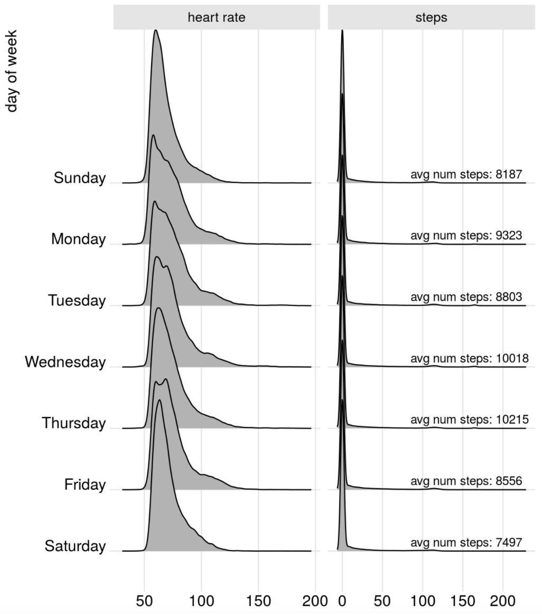

## Lessons learned from Carpentry connect 

- Let them eat cake (first)
- Never take over the keyboard
- Power of the stickies
- Live coding is good for learning (apparently!)
---

## Example of some teaching material

We are going to run through a small amount of teaching material that has been developed by Mine Çetinkaya-Rundel for an intro to stats course. 

---

class: center, middle

# Data in the wild

---

# Data from wearables

**A year as told by fitbit**

.pull-left[
by Nick Strayer

http://livefreeordichotomize.com/2017/12/27/a-year-as-told-by-fitbit/
]
.pull-right[

]
---

# Trump's tweets

**Text analysis of Trump's tweets confirms he writes only the (angrier) Android half**

.pull-left[
by David Robinson (Stack Overflow)

http://varianceexplained.org/r/trump-tweets/
]
.pull-right[

]

---

## Create a GitHub account

.instructions[
Go to [github.com](https://github.com/), and create an account (unless you already have one). 
]

Tips for selecting a username:✦

.midi[
- Incorporate your actual name.
- Reuse username from other contexts, e.g., Twitter or Slack.
- Pick a username you'll be comfortable revealing to your future boss.
- Shorter is better than longer.
- Be as unique as possible in as few characters as possible.
- Make it timeless. Don’t highlight your current university, employer, etc.
- Avoid words laden with special meaning in programming, like `NA`.
]

.instructions[
Once done, place a green sticky on your laptop. If you have questions, place a pink sticky.
]

.footnote[ 
✦ Source: [Happy git with R](http://happygitwithr.com/github-acct.html#username-advice) by Jenny Bryan
]

---

## Join RStudio Cloud

.instructions[
Go to [https://bit.ly/326oddl], and log in with your GitHub credentials.
]

.instructions[
Once done, place a green sticky on your laptop. If you have questions, place a pink sticky.
]

---

## <i class="fas fa-laptop"></i> `AE 01 - UN Votes` 

Create your first data visualization!

- Log on to RStudio Cloud and click `Projects` then open this project `MEP_R`
- Make a copy of the project for this application exercise and launch it.
- In the Files pane in the bottom right corner, spot the file called `UN_votes.Rmd` it's in the `Tutorial` folder. Open it, and then click on the "Knit" button.
- Go back to the file and change your name on top (in the `yaml` -- we'll talk about what this means later) and knit again.
- Then, change the country names to those you're interested in. Your spelling and capitalization should match how the countries appear in the data, so take a peek at the Appendix to confirm spelling. Knit again. And voila, your first data visualization!

.instructions[
Once done, place a green sticky on your laptop. If you have questions, place a pink sticky.
]

